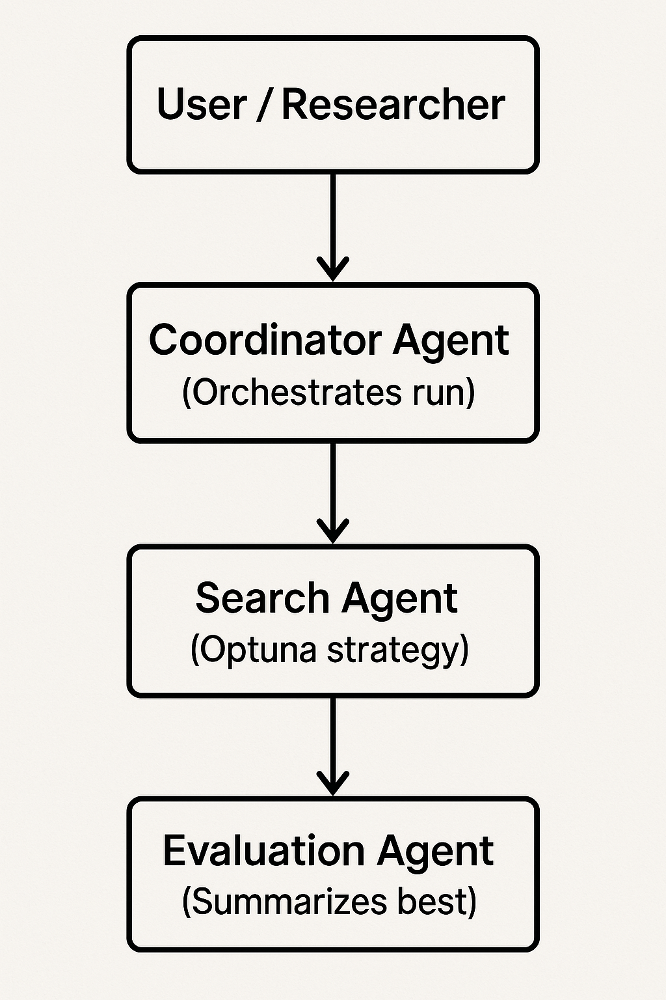

# Efficient Deep Neural Network Architecture Search Using AI Agents
---

## Overview

Designing deep neural network (DNN) architectures is complex and resource-intensive. This project provides an **AI Agent-based Neural Architecture Search (NAS)** framework that automates model design through coordinated agents. The goal is high accuracy, computational efficiency, and sustainability (Green AI principles).

---

## Objectives

- Develop a **multi-agent system** for automated architecture search and evaluation.
- Optimize DNN architectures for **accuracy**, **efficiency**, and **low energy consumption**.
- Integrate **Optuna** (current), with a path to **RL**, **Bayesian optimization**, or **evolutionary strategies**.
- Measure and analyze **sustainability metrics** such as FLOPs, CO2e, and model size.
- Demonstrate reproducibility and scalability across standard datasets (e.g., MNIST, CIFAR-10).

---

## System Architecture



Agents communicate via in-memory handoffs; search results are summarized and logged.

---

## Key Features

- **Agent-Based NAS:** Coordinator → Search → Evaluation pipeline for model discovery.
- **Search Optimization:** Optuna-based search space for CNN hyperparameters (extensible to RL/evolutionary).
- **Model Efficiency Tracking:** Logs FLOPs, parameters, and CO2e (when CodeCarbon available).
- **Green AI Compliance:** Tracks emissions and promotes efficient searches.
- **Explainability:** Evaluation agent produces summaries (best value/params, top trials, attrs).

---

## Installation

```bash
git clone https://github.com/kaianes/efficient-nas-ai-agents.git
cd efficient-nas-ai-agents
python -m venv venv
# On Unix/macOS
source venv/bin/activate
# On Windows
venv\Scripts\activate
pip install -r requirements.txt
```

---

## Quick Start

Run a minimal experiment with baseline settings:

```bash
python src/main.py --config experiments/configs/baseline.yaml
```

The command executes the Coordinator → Search (Optuna) → Evaluation pipeline and logs a summary.

---

## Datasets

Supported datasets:

- **MNIST**
- **Fashion-MNIST**
- **CIFAR-10**

Each dataset will be automatically downloaded and preprocessed.

---

## Metrics

| Metric      | Description                      |
| ----------- | -------------------------------- |
| Accuracy    | Model classification performance |
| FLOPs       | Computational complexity         |
| Params      | Model parameter count            |
| CO2e        | Estimated carbon emissions       |
| Search Time | NAS process duration             |

---

## Agent Pipeline Details

- **CoordinatorAgent:** Orchestrates the run, delegates to search and evaluation, logs the final summary.
- **SearchAgent (Optuna):** Samples hyperparameters and executes `nas/optuna_search.py`. Returns best value/params plus trial records and attrs (params/FLOPs/trial count).
- **EvaluationAgent:** Summarizes the search with best metrics and a short leaderboard.

---

## Project Structure

```
src/
  agents/
    coordinator_agent.py  # Orchestrates search + evaluation
    search_agent.py       # Wraps NAS strategy (Optuna)
    evaluation_agent.py   # Summaries/leaderboard
  nas/
    optuna_search.py      # Optuna objective and search loop
  models/
    simple_cnn.py         # Baseline CNN architecture
  datasets/
    loader.py             # TorchVision loaders
  utils/
    logger.py, env.py, metrics.py, carbon.py
  main.py                 # Entry point (runs agent pipeline)
experiments/
  configs/                # YAML configs (baseline.yaml)
  results/                # Outputs and logs
  artifacts/
checkpoints/
docs/
  report/                 # Project report drafts
```

---

## Sustainability & Ethics

Aligned with **Green AI** principles:

- Efficient architecture design to reduce training redundancy.
- CO2e estimation for every experiment when CodeCarbon is installed.
- Encourages low-power hardware usage where possible.

---

## License

MIT License. See `LICENSE`.

---
