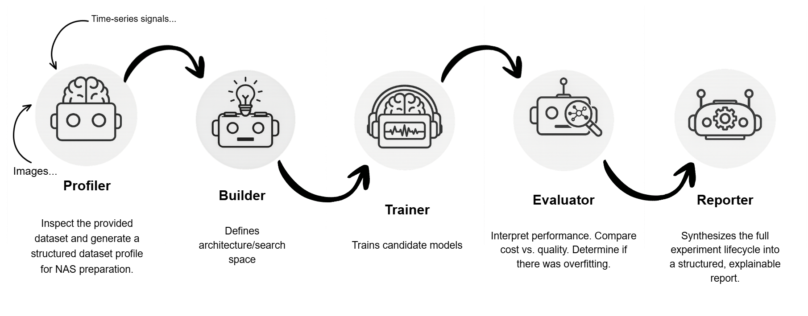

# Agent-Based Neural Architecture Search for Efficient Model Design

<p align="center">
  
</p>

## Project Objective

Build an agent-driven NAS (Neural Architecture Search) workflow that reduces time-to-model and experimentation cost by automating how candidate architectures are profiled, planned, optimized, and reported.

## Business Value

- Accelerates model discovery with less manual iteration.
- Standardizes experiment flow and outputs for reproducibility.
- Improves decision quality with structured evaluation and reporting.

## How It Works

<p align="center">
  
</p>

Current pipeline (CrewAI):

1. `dataset_profiler`: analyzes dataset evidence.
2. `builder_agent`: creates bounded NAS search space in JSON.
3. `trainer_agent` (optional, ECG): runs Optuna over model families.
4. `evaluator_agent` (optional): ranks quality/cost trade-offs.
5. `report_agent` (optional): generates final markdown report.

## Current Scope

- `ecg` mode: end-to-end flow (profile -> build -> train -> evaluate -> report).
- `xray` mode: profile + build (training path not enabled yet).
- Entrypoint: `run_crew` (`agentic_nas.main:run`).

## Quick Start

```bash
cd agentic_nas
uv sync
uv run run_crew --mode ecg --include-trainer --include-evaluator --include-reporter --trainer-trials 5
```

## Outputs

Each run writes artifacts to `agentic_nas/data/outputs/runs/<run_id>/`:

- `manifest.json`
- `crew_result.json`
- `agents/*.json`
- `report.md` (when reporter is enabled)

Latest run pointer: `agentic_nas/data/outputs/latest_run.txt`.

## Limitations

- X-ray training/evaluation/reporting is not yet active.
- Evaluator cost scoring is heuristic.
